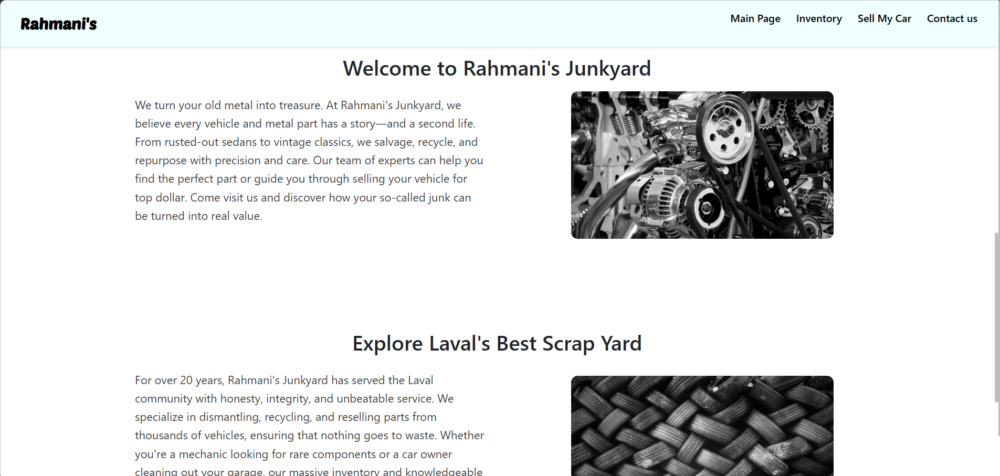
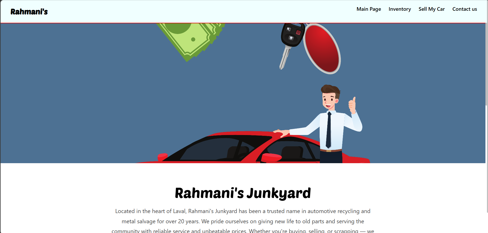
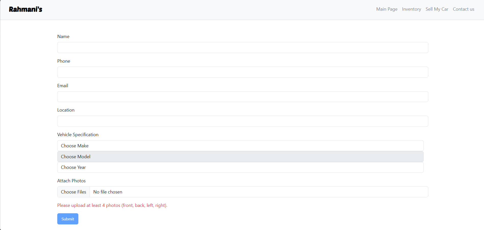
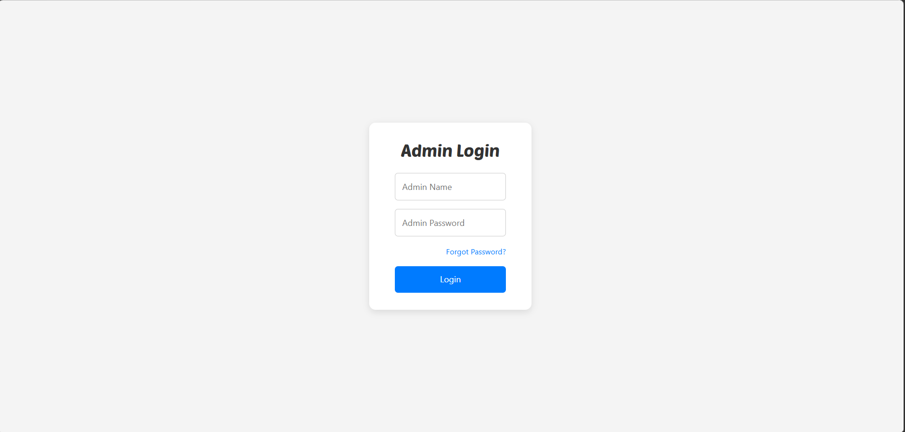
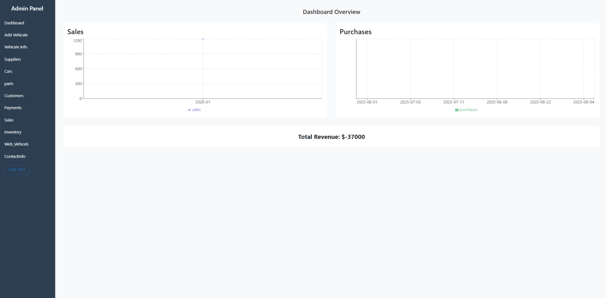
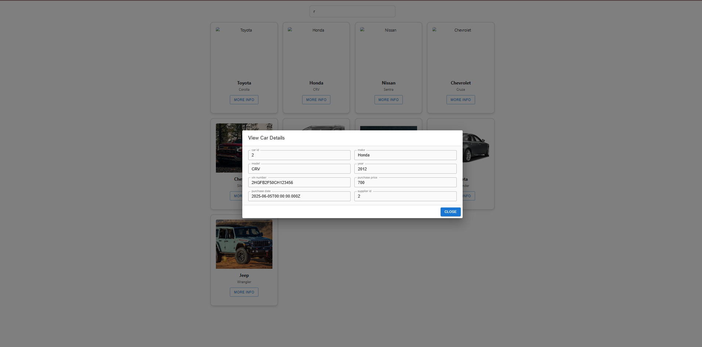
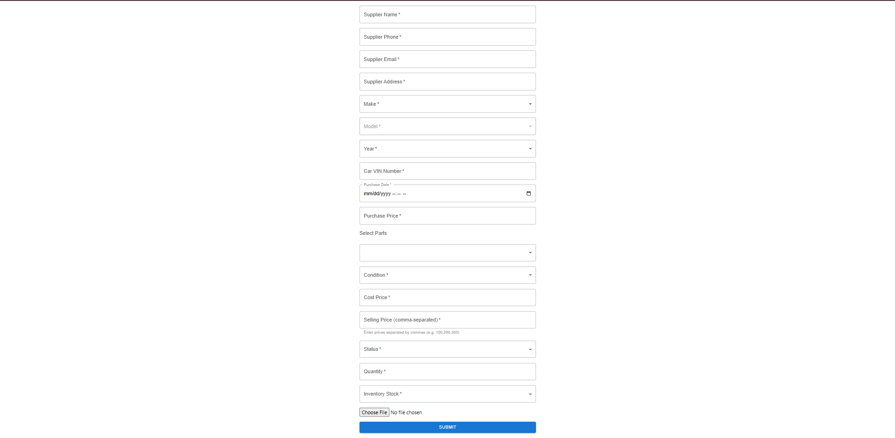
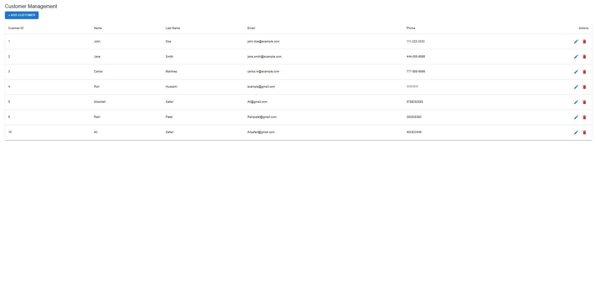
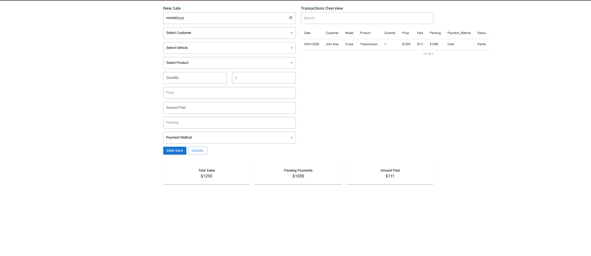

# 🚗 Rahmani's Junkyard

A full-stack web application for a car junkyard/salvage business, built with a **client-facing storefront** and a **secure admin panel** for managing inventory, sales, customers, and suppliers.

Live demo: _add your deployed link here, if any_

---

## 📌 Overview

Rahmani's Junkyard helps a salvage yard move online. Customers can browse available vehicles and parts, request to sell their own car, or contact the business directly. On the back end, staff manage every part of the operation — from vehicle intake to parts inventory, customer records, and payments — through a dedicated admin dashboard.

---

## ✨ Features

### Client Side
- **Welcome / Home Page** — business overview and branding
- **Inventory Search** — search vehicles by make and model, view available cars with images
- **Sell My Car** — customers submit their vehicle info (name, phone, email, location, make/model/year) and upload at least 4 required photos (front, back, left, right)
- **Contact Us** — contact form with business info and social links

### Admin Side
- **Secure Admin Login** with Forgot Password / Reset Password flow (email-based reset link)
- **Dashboard** — sales and purchases overview with charts, total revenue tracking
- **Add Vehicle** — intake form for new vehicles, including supplier info, part details, pricing, and inventory stock
- **Vehicle Info** — full searchable table of vehicles and their associated parts, with edit/update/delete support
- **Parts Management** — browse and search parts by name, condition, cost/sell price, and status
- **Customer Management** — add, edit, and delete customer records
- **Sales** — record new sales, track payment status (paid/pending), and view a transactions overview
- **Supplier Management** — track supplier contact details tied to vehicle purchases
- **Customer Contact Messages** — view and reply to messages submitted through the Contact Us form

---

## 🛠️ Tech Stack

> _Fill in with what you actually used — example below:_

- **Frontend:** HTML, CSS, JavaScript (React, if used)
- **Backend:** Node.js, Express
- **Database:** MySQL / SQL Server
- **Authentication:** Session/JWT-based login, email-based password reset
- **Other Tools:** Git, GitHub

---

## 📸 Screenshots

| Welcome Page | Inventory Search | Sell My Car |
|---|---|---|
|  |  |  |

| Admin Login | Admin Dashboard | Vehicle Info |
|---|---|---|
|  |  |  |

| Add Vehicle | Customers | Sales |
|---|---|---|
|  |  |  |

_Add or rename images as needed to match your `screenshots` folder._

---

## 🚀 Getting Started

### Prerequisites
- Node.js installed
- A database (MySQL/SQL Server) set up and running

### Installation
```bash
# Clone the repository
git clone https://github.com/Rohullah1122/rahmanis-website.git

# Move into the project folder
cd rahmanis-website

# Install dependencies
npm install

# Start the server
npm start
```

The app will run at `http://localhost:3000` (or your configured port).

### Environment Variables
Create a `.env` file in the root directory with values such as:
```
DB_HOST=your_database_host
DB_USER=your_database_user
DB_PASSWORD=your_database_password
DB_NAME=your_database_name
EMAIL_USER=your_email@gmail.com
EMAIL_PASS=your_app_password
PORT=3000
```

---

## 📂 Project Structure
```
rahmanis-website/
├── public/            # Static assets (CSS, JS, images)
├── screenshots/        # Project screenshots for this README
├── routes/             # Backend routes
├── views/              # Frontend pages/templates
├── server.js           # Entry point
└── README.md
```

---

## 👤 Author

**Rohullah Rahmani**
- GitHub: [@Rohullah1122](https://github.com/Rohullah1122)
- LinkedIn: _add your link here_

---

## 📄 License

This project is for educational/portfolio purposes.
